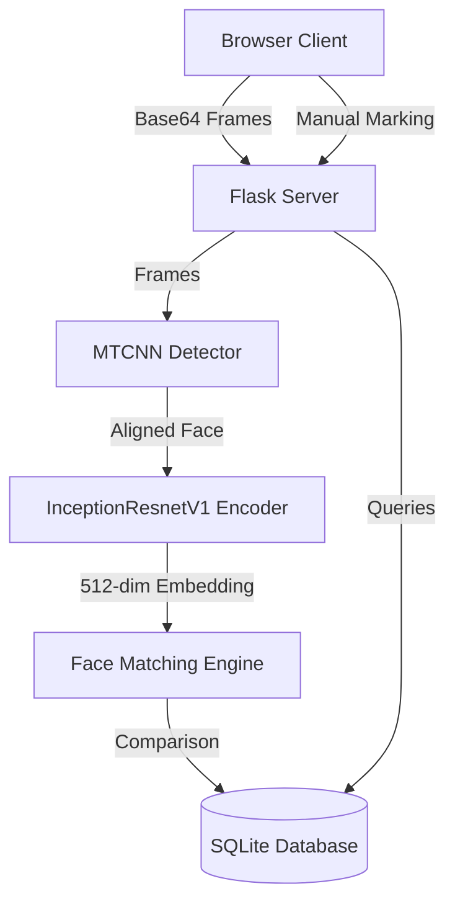

# Attendify — Premium ML Face Recognition Attendance System

Attendify is a state-of-the-art web-based student attendance system that leverages Deep Learning to perform real-time face detection and identification. Built on a clean Flask backend and a modern Tailwind-powered single-page application (SPA) frontend, Attendify provides instant recognition, manual attendance overrides, and detailed year-wise statistical insights and reports.

---

## 🌟 Key Features

- **Real-Time AI Face Recognition**: Automatically detects and identifies registered students from a live camera feed with low latency (under 200ms processing window).
- **Face Capture & Enrollment Guidance**: Step-by-step guidance interface to enroll new students using a live camera capture or photo upload. Incorporates duplicate checking based on contact details and biometrics.
- **Year-wise Selection & Filtering**: Instantly filter all views (Dashboard statistics, Student Directory, Manual Attendance, Reports) by 1st, 2nd, 3rd, and 4th Year Level using a dedicated sidebar selector menu.
- **Day Type & Holiday Control**: A calendar control widget in the top-right header of the dashboard allows users to mark any day as a **Working Day** or a **Holiday**. Recalculates stats and student attendance percentages instantly.
- **Sunday Default Logic**: Sundays are automatically flagged as holidays to maintain accurate attendance percentages, with the ability to override them manually to working days.
- **Interactive Data Visualization**: Dynamic doughnut and weekly stacked bar charts powered by Chart.js that update in real time.
- **Manual Attendance Overrides**: One-click toggle buttons to manually mark a student as **Present**, **Absent**, or **Late** (with automatic Late designation for sign-ins after 9:00 AM).
- **Filtered PDF Reports**: Instantly export custom attendance reports to PDF, filtered by date range, department, and year level.
- **Sleek Light/Dark Mode**: High-fidelity modern UI styling using Tailwind CSS with glassmorphic elements and seamless transition effects.

---

## 🛠️ System Architecture & Stack



- **Frontend**: HTML5 Video & Canvas, Tailwind CSS, FontAwesome, Chart.js.
- **Backend**: Python 3, Flask.
- **Database**: SQLite3.
- **Deep Learning Model**: PyTorch, Facenet-PyTorch (`MTCNN` for aligned face detection, `InceptionResnetV1` pre-trained on VGGFace2 for face descriptor extraction).
- **Image Processing**: OpenCV (OpenCV-Python).
- **Report Generation**: FPDF2.

---

## 🚀 Getting Started

### 📋 Prerequisites

Ensure you have Python 3.8+ installed on your system. It is highly recommended to run this project inside a virtual environment.

### ⚙️ Installation

1. **Clone the repository**:
   ```bash
   git clone https://github.com/RAMKUMAR-TECH10/ML-Face-Attendance.git
   cd ML-Face-Attendance
   ```

2. **Set up a Virtual Environment**:
   ```bash
   python -m venv .venv
   # On Windows:
   .venv\Scripts\activate
   # On macOS/Linux:
   source .venv/bin/activate
   ```

3. **Install Dependencies**:
   ```bash
   pip install --upgrade pip
   pip install -r requirements.txt
   ```
   *Note: If you have issues compiling cmake or dlib, ensure C++ Build Tools are installed on your Windows machine.*

---

## 🖥️ Running the Application

### Windows (Quick Launch)
You can double-click or run the provided batch file in Command Prompt/PowerShell:
```cmd
click_to_run_in_windows.bat
```

### Manual Run
Activate your virtual environment and launch `app.py`:
```bash
python app.py
```

Once started, open your web browser and navigate to:
```
http://127.0.0.1:5000
```

---

## 📂 Project Structure

- `app.py`: Main Flask application handling routes, API endpoints, camera frames, and AI threads.
- `database_manager.py`: SQLite connection helper managing schemas, adding/updating students, and logging attendance.
- `attendance_manager.py`: Checks cooldown timers and marks students as Present or Late.
- `camera_module.py`: Handles thread-safe OpenCV webcam access.
- `recognition_engine.py`: Manages the FaceNet model pipeline (locations, embeddings, and distance calculation).
- `templates/index.html`: Main SPA frontend template integrating all pages, styles, and JavaScript handlers.
- `requirements.txt`: List of Python packages required for the project.
- `data/logs/attendance.db`: SQLite database file (created automatically on startup).

---

## 🔍 Troubleshooting

- **Webcam Access Issues**: If the Face Scanner camera feed shows "offline", verify that no other program is using your webcam. If running inside a virtual machine or container, ensure USB forwarding is enabled.
- **Model Downloads**: On the first execution, `facenet-pytorch` will automatically download the pre-trained weights for `MTCNN` and `InceptionResnetV1`. Make sure you have a stable internet connection.
- **Low FPS / Laggy Feed**: Ensure your device is plugged in. The backend automatically scales down frames to 480p for display and further downscale for AI recognition to ensure optimal latency on standard CPU devices.
